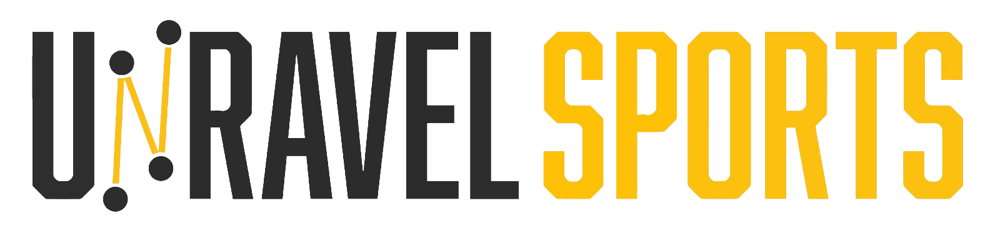

<iframe src="https://player.vimeo.com/video/814914982?h=69b41b37c8&amp;badge=0&amp;autopause=0&amp;player_id=0&amp;app_id=58479" frameborder="0" allow="autoplay; fullscreen; picture-in-picture" allowfullscreen style="position:absolute;top:0;left:0;width:100%;height:100%;" title="Video.mp4"></iframe>

## Introduction
This project is a proof-of-concept by [UnravelSports](https://unravelsports.github.io/) to show football/soccer data in 3D using the [Rust programming language](https://www.rust-lang.org/) and the [Bevy game engine](https://bevyengine.org/).

## Install Rust
Follow the steps in the [Official Rust Documentation](https://www.rust-lang.org/tools/install) on how to install Rust.

## Build
After pulling the code for the first time run `cargo build` inside the project folder.

## Run
Then run `cargo run`.

## Resources
- [Rust Language Open-Source Book](https://github.com/rust-lang/book)
- [Basic Bevy Development by LogicProjects](https://www.youtube.com/@logicprojects)
- [Bevy Tower Defense Game by LogicProjects](https://github.com/mwbryant/bevy-tower-defense-tutorial)
- [JSON in Rust](https://blog.devgenius.io/reading-and-writing-a-json-file-in-rust-2731da8d6ad0)
- [3D Model Hoa Xuan Stadium](https://sketchfab.com/3d-models/hoa-xuan-stadium-5fc8ffbb5c824d20b2bdb74a26e093f1)
- [3D Model Player](https://free3d.com/3d-model/soccerplayer-v3--391717.html)

